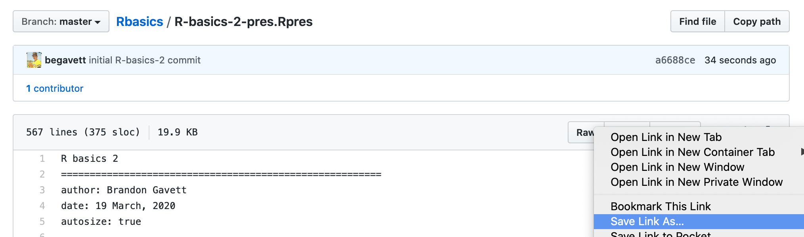
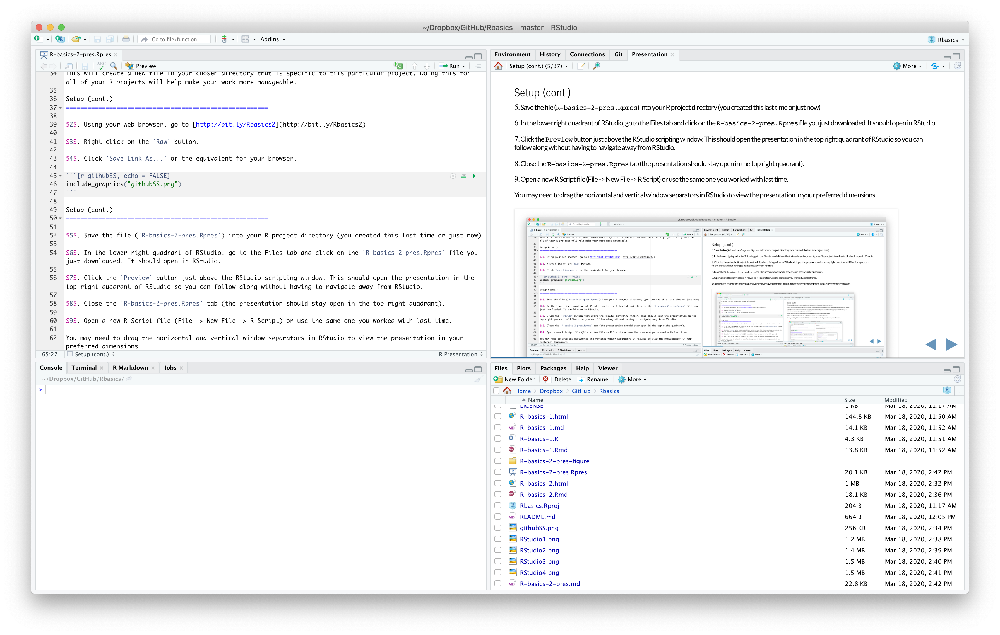
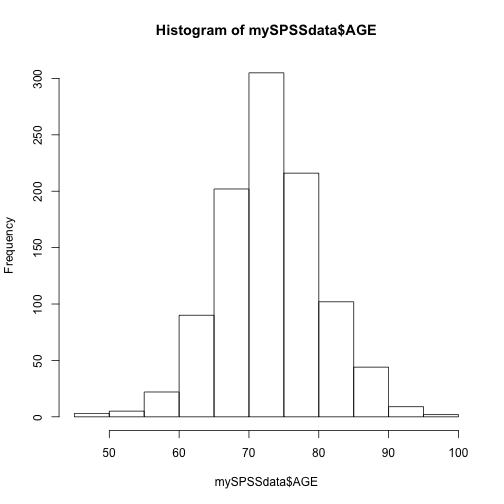
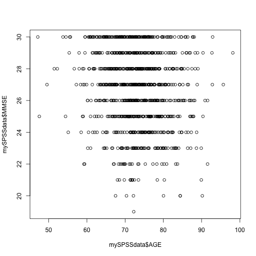
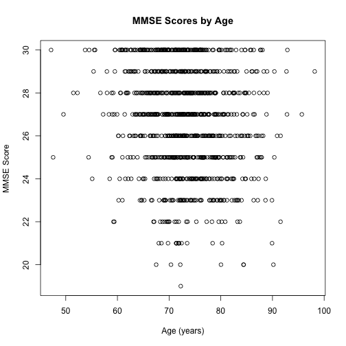
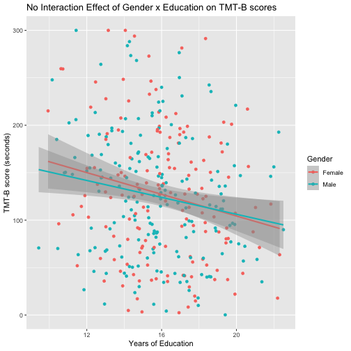

R basics 2
========================================================
author: Brandon Gavett
date: 19 March, 2020
autosize: true


Setup
========================================================

1. Open RStudio by clicking on the R Project (`.Rproj`) file you created last time. If you didn't create a project, you can do so now using the dropdown menu in the extreme top right corner of RStudio.


R Projects
========================================================

In the top right corner of RStudio, note the icon and text reading, **Project: (None)**

1. Click this
2. Click **New Project...**
3. Click **Don't Save** if prompted
4. Choose either New Directory or Existing Directory, depending on whether you've already created a new directory for this workshop. The goal is to start a new project for this workshop called **R basics**
  + If you haven't created a new directory for this workshop, click **New Directory** 
      - Then click **New Project**
      - Name your directory and decide where it goes.
  + If you have created a new directory for this workshop, click **Existing Directory**
      - Choose the correct directory
5. Check the **Open in new session** box.
6. Click **Create Project**.
          
This will create a new file in your chosen directory that is specific to this particular project. Doing this for all of your R projects will help make your work more manageable.

Setup (cont.)
========================================================

$2$. Using your web browser, go to [http://bit.ly/Rbasics2](http://bit.ly/Rbasics2)

$3$. Right click on the `Raw` button.

$4$. Click `Save Link As...` or the equivalent for your browser.



Setup (cont.)
========================================================

$5$. Save the file (`R-basics-2-pres.Rpres`) into your R project directory (you created this last time or just now)

$6$. In the lower right quadrant of RStudio, go to the Files tab and click on the `R-basics-2-pres.Rpres` file you just downloaded. It should open in RStudio.

$7$. Click the `Preview` button just above the RStudio scripting window. This should open the presentation in the top right quadrant of RStudio so you can follow along without having to navigate away from RStudio.

$8$. Close the `R-basics-2-pres.Rpres` tab (the presentation should stay open in the top right quadrant).

$9$. Open a new R Script file (File -> New File -> R Script) or use the same one you worked with last time.

You may need to drag the horizontal and vertical window separators in RStudio to view the presentation in your preferred dimensions.



Where we left off...
========================================================

Most of the time, our data are more complex than 5 data points. And those data sets are usually stored in separate files in various formats (e.g., .csv, .sav). Let's learn to read in some data.

CSV
========================================================

+ CSV (comma separated values) is probably the most flexible data format and most universally compatible, because it's stored as plain text. The downside of CSV files is that they don't contain metadata, like value labels or missing flags.
  - Depending on the data, this may or may not be a problem.
  - In general, I prefer CSV.
+ Reading in a CSV file to R is easy.


```r
myCSVdata <- read.csv("fakeData.csv", header = TRUE)
```

If we want to see what our data look like, we have several options. Try each of these and annotate your code to remind yourself of how they differ.

Dump as much as possible to screen


```r
myCSVdata
```

`View()`


```r
View(myCSVdata)
```

`head()`


```r
head(myCSVdata)
```

`glimpse()`


```r
glimpse(myCSVdata)
```

Removing objects
========================================================

We won't be working with the CSV file anymore, so it's good practice to remove it from our R session. For that, we use the `rm()` command.


```r
rm(myCSVdata)
```

SPSS Files
========================================================

If your data set is in SPSS format, you can use the `haven` package to read it in to R. First, let's make sure `haven` is ready to go by loading it, along with the `tidyverse` package. We'll do this using `pacman`, as we learned about last time. Then, let's read in our SPSS file (.sav extension).


```r
library(pacman)
p_load(tidyverse, haven)
```


```r
mySPSSdata <- read_sav("fakeData.sav")
```

*Note: if your SPSS file has missing data codes that you want to import into R, you should add the argument `user_na = TRUE`, like this*:


```r
mySPSSdata <- read_sav("fakeData.sav", user_na = TRUE)
```

Next, use the same 4 commands you previously used to view the CSV object, but applied to the new `mySPSSdata` object you just created.

How are they the same? How are they different?

Getting to Know Your Data
========================================================

When reading in CSV or SAV files the default is to make the objects a `data.frame`, which is the most common way of storing rectangular data where different columns are allowed to store different types of data (e.g., some numeric, some character, some factors).

Once you have your data frame loaded into R, it is important to learn how to view, manipulate, and summarize its contents.

Data structure
========================================================

Every `data.frame` has its own internal structure that is essential for you to be aware of. To view the structure of the data, execute the `str()` function.


```r
str(mySPSSdata)
```

Annotate your syntax with a description of what you just observed after running this command. Make sure you take some time to study the output.

Data structure
========================================================

One of the most important pieces of information you can get from learning your data's structure is the name of the variables (columns) in your data object.

Note how each column is prefixed with a dollar sign. If we wanted to examine one specific variable (column) of the data set, we could ask for only that variable to be printed to our screen:


```r
mySPSSdata$AGE
```

This shows the contents of the `AGE` variable in my data set. If I only wanted to see the beginning of that column (first 6 rows by default), I could ask R to show me the header with the `head()` function. Similarly, the `tail()` function shows me the last 6 rows in that column.


```r
head(mySPSSdata$AGE)
```

```
[1] 69.36 66.86 87.28 74.38 79.82 69.07
```


```r
tail(mySPSSdata$AGE)
```

```
[1] 75.63 73.77 73.67 84.30 68.04 73.62
```

The `head()` and `tail()` functions can be applied to entire data frames, too. Try calling `head()` and `tail()` on the `mySPSSdata` object.

*Advanced skills practice: Try asking `R` to show you the last 10 rows of the `mySPSSdata` object instead of the default of 6 rows.*


Column names
========================================================

The easiest way to see the name of every column in your data set is to ask for its `names()`.


```r
names(mySPSSdata)
```

The same thing could be achieved with the `colnames` function.


```r
colnames(mySPSSdata)
```

As a general rule, there are usually multiple ways to achieve the same goal in R.


Descriptive Statistics
========================================================

The `psych` package does a great job providing descriptive statistics. Let's look at descriptives for our entire data set using the `describe()` function. 

*Technical detail: sometimes different packages have functions with the same name. For example, the `Hmisc` and `psych` packages both have a function called `describe()`. To explicitly tell R to use the `describe()` function from the `psych` package, we prepend our function call with `psych::`.*


```r
psych::describe(mySPSSdata)
```

Note that we haven't actually loaded the `psych` package yet. Prepending our function call with `psych::` allowed us to run that function even though the package isn't loaded. Let's load that package now.


```r
p_load(psych)
```

Descriptive Statistics
========================================================

The `psych` package also allows us to view descriptives by group. Let's look at the same descriptives, but broken down by diagnosis (`DX`) using the `describeBy` function.


```r
describeBy(mySPSSdata, mySPSSdata$DX)
```

Histograms
========================================================

In addition to descriptives, we may also want to visualize our data. One of R's greatest features is its plotting capabilities, which is an entire workshop in and of itself. For now, we'll stick with some simple plots.


```r
hist(mySPSSdata$AGE)
```



Scatterplots
========================================================

Scatterplots are as simple as specifying what you want on the x and y axes.


```r
plot(x = mySPSSdata$AGE, y = mySPSSdata$MMSE)
```



Plot customization
========================================================


```r
plot(x = mySPSSdata$AGE, y = mySPSSdata$MMSE, xlab = "Age (years)", ylab = "MMSE Score", 
     main = "MMSE Scores by Age")
```



Frequencies
========================================================

You'll notice that the `describe()` and `describeBy()` functions treated categorical variables as numeric, leading to some nonsensical values, like the mean of racial category (`PTRACCAT`). Instead, we can summarize categorical data as frequencies using the `table()` command.


```r
table(mySPSSdata$PTRACCAT)
```

```

  1   2   4   5   6   7 
  1  16  54 912  11   6 
```

What can you conclude about the distribution of races in this sample?

Proportions
========================================================

If you want to see **prop**ortions instead of or in addition to frequencies, you can use the `prop.table()` function.


```r
prop.table(mySPSSdata$PTRACCAT)
```

<!-- https://emoji.muan.co/# -->

😕

Problems
========================================================

However, as you can see here, we run into some problems. This weird output gives us a good excuse to delve a little deeper into the nuances of coding in R.

Whereas `table()` simply required us to specify the column of data we wanted to use to calculate frequencies, `prop.table` doesn't expect the raw data as its input, it expects the table we just created as the input.

So, how do we go about telling `prop.table` to work its magic on the results that are generated by `table`?

Nested functions
========================================================

We have three options to solve this problem.

First, we could use nested functions (putting one function inside another function).


```r
prop.table(table(mySPSSdata$PTRACCAT))
```

```

    1     2     4     5     6     7 
0.001 0.016 0.054 0.912 0.011 0.006 
```

Step by step
========================================================

Second, we could break our problem into two steps:

1. Save the results of the `table()` function as a new object
2. Run the `prop.table()` function on that new object

Here's what that would look like:


```r
raceTable <- table(mySPSSdata$PTRACCAT)
```
  

```r
prop.table(raceTable)
```

```

    1     2     4     5     6     7 
0.001 0.016 0.054 0.912 0.011 0.006 
```

Piping
========================================================

To use pipes, we need to load the `magrittr` package.


```r
p_load(magrittr)
```

The `magrittr` pipe looks like this: `%>%` and can be typed one character at a time, or using the key-combination of `control` + `shift` + `M`.

Here's how it could be used to solve our problem:


```r
mySPSSdata$PTRACCAT %>% 
  table() %>% 
  prop.table()
```

Note how this is similar to our two other solutions:

## Nested 


```r
prop.table(table(mySPSSdata$PTRACCAT))
```

## Sequential


```r
raceTable <- table(mySPSSdata$PTRACCAT)
prop.table(raceTable)
```

Learning how to use pipes can make your code easier to follow (code can become almost unreadable if it contains multiply-nested functions), and it also reduces the number of objects you end up with in your system environment (a problem with creating intermediary objects).

A little more on piping
========================================================

If we wanted to save the results of our piping operations to a new object, we could have used the arrow (`<-`) assignment operator.


```r
propTableWithPipes <- mySPSSdata$PTRACCAT %>% 
  table() %>% 
  prop.table()
```

Split-Apply-Combine
========================================================

Piping can also be used in a family of operations called *split-apply-combine*.

This does exactly what it says it should do.

1. It splits your data set up into groups.
2. It applies some function to the split data
3. It combines the split data back together.

For example, let's suppose we wanted to find the lowest, median, and highest 2.5% quantiles of CSF tau by marital status (🤷‍♂)

1. Split the data by diagnosis (`PTMARRY`)
2. Apply the `quantile()` and `median()` functions to the education variable (`TAU`)
3. Combine the data back together


```r
mySPSSdata %>%
  group_by(PTMARRY) %>%
  summarise(low2.5 = quantile(TAU, .025),
            median = median(TAU),
            hi2.5 = quantile(TAU, .975))
```

Subsetting and filtering data
========================================================

## dplyr

One of the core elements of the tidyverse is the `dplyr` package, which helps us organize our data effectively.

Let's assume we wanted to apply some inclusion/exclusion criteria to our data and reduce the number of variables that we have to contend with. We'll limit our data to healthy controls and focus on the cognitive test scores available in our data set.

First, we have to know how R is storing information about diagnosis, which is contained in the `DX` variable. Let's look at its structure.


```r
str(mySPSSdata$DX)
```

Then, we will need to know the names of the columns in our data set so we can identify the ones we want to keep.


```r
names(mySPSSdata)
```

Let's keep the following: `CDRSB`, `MMSE`, `TRABSCOR`, and `RAVLT.learning`. We should also keep the participant ID number (`ID`) and some demographic data, like `AGE`, `PTEDUCAT`, and `PTGENDER`.

Subsetting and filtering data (cont.)
========================================================


```r
myDataSubset <- mySPSSdata %>%
  filter(DX == 1) %>%
  select(CDRSB, MMSE, TRABSCOR, RAVLT.learning,
         ID, AGE, PTEDUCAT, PTGENDER)
```

Let's take a look at the new data set to make sure it's formatted as we intended.


```r
myDataSubset
```

```
# A tibble: 368 x 8
   CDRSB  MMSE TRABSCOR RAVLT.learning    ID   AGE PTEDUCAT   PTGENDER
   <dbl> <dbl>    <dbl>          <dbl> <dbl> <dbl>    <dbl>  <dbl+lbl>
 1 -1.44    30   -42.6            9.2   1001  69.4     14.7 2 [Male]  
 2  1.6     27   139.             1.02  1002  66.9     16.2 2 [Male]  
 3  5.19    21   246.             4.13  1011  71.8     15.4 1 [Female]
 4  4.45    25   189.             1.72  1013  71.1     12.1 2 [Male]  
 5  0.65    30   136.             3.76  1014  76.0     13.7 2 [Male]  
 6  1.63    28   197.             8     1016  74.4     17.0 1 [Female]
 7 -0.92    30    -5.85           4.03  1019  68.7     15.7 2 [Male]  
 8  0.35    30    87.7            5.95  1023  68       20.9 1 [Female]
 9  0.64    26    29.6            6.05  1025  66.9     17.5 1 [Female]
10  2.63    25   167.             2.37  1026  75.8     15.3 2 [Male]  
# … with 358 more rows
```

And finally, one of our research assistants was concerned about the accuracy of the TMT-B data for a number of participants, whose scores either exceeded the maximum allowable score (300 s) or were impossible values (< 0). How do we examine those data?

Further subsetting
========================================================

R allows for considerable refinement in the way data are subsetted. Here's one way we could look for problematic data:


```r
myDataSubset[myDataSubset$TRABSCOR > 300, ]
```

```
# A tibble: 3 x 8
  CDRSB  MMSE TRABSCOR RAVLT.learning    ID   AGE PTEDUCAT   PTGENDER
  <dbl> <dbl>    <dbl>          <dbl> <dbl> <dbl>    <dbl>  <dbl+lbl>
1  1.09    24     317.           3.51  1407  76.3     11.4 2 [Male]  
2  5.5     24     342.          -0.64  1560  64.2     13.2 1 [Female]
3  4.18    27     316.           0.43  1775  75.2     14.1 1 [Female]
```


```r
myDataSubset[myDataSubset$TRABSCOR < 0, ]
```

```
# A tibble: 23 x 8
   CDRSB  MMSE TRABSCOR RAVLT.learning    ID   AGE PTEDUCAT   PTGENDER
   <dbl> <dbl>    <dbl>          <dbl> <dbl> <dbl>    <dbl>  <dbl+lbl>
 1 -1.44    30   -42.6            9.2   1001  69.4     14.7 2 [Male]  
 2 -0.92    30    -5.85           4.03  1019  68.7     15.7 2 [Male]  
 3 -4.27    30   -41.6            9.86  1077  65.6     19.1 2 [Male]  
 4 -2.14    30  -127.             9.75  1088  69.1     24.7 2 [Male]  
 5 -3.66    30   -94.0           12.2   1140  70.4     19.2 1 [Female]
 6 -3.19    30   -39.7            9.58  1147  76.0     16.7 1 [Female]
 7  0.38    30    -4.54          10.2   1153  73.7     18.0 2 [Male]  
 8 -3.12    30    -4.38           6.5   1180  75.1     19.2 2 [Male]  
 9 -0.96    30   -61.2            8.28  1229  62.0     15.3 2 [Male]  
10  0.65    28   -55.4            4.8   1338  76.3     16.2 2 [Male]  
# … with 13 more rows
```

Bracket Notation
========================================================


```r
dataFrame[row, column]
```

OR


```r
dataFrame$column[row]
```

Bracket notation
========================================================

This prints the first row and the first column


```r
dataFrame[1, 1]
```

This prints the first row and all columns


```r
dataFrame[1, ]
```

This prints the all rows and the 4th column


```r
dataFrame[, 4]
```

This prints rows 1 to 10 and columns 1 to 5


```r
dataFrame[1:10, 1:5]
```

This prints all rows except the first two, and the column named `AGE`


```r
dataFrame[-c(1, 2), "AGE"]
```

Changing data points
========================================================

Getting back to the problem our RA identified in our data, let's change any `TRABSCOR` value that's > 300 to 300.


```r
myDataSubset$TRABSCOR[myDataSubset$TRABSCOR > 300] <- 300
```

## An alternative method:


```r
myDataSubset[myDataSubset$TRABSCOR > 300, "TRABSCOR"] <- 300
```

Changing data points
========================================================

We should also exclude participants with impossible values on TMT-B, so let's do that too. The `which()` function identifies the row numbers that meet a certain condition. The negative sign in front of `which` says to remove those identified row numbers from the data set completely. The `,]` at the end means to retain all columns in the data set.


```r
myDataSubset <- myDataSubset[-which(myDataSubset$TRABSCOR < 0),]
```

*Note:* **These edits only apply to our object called `myDataSubset`. They don't change the values of the file stored on our hard drive, nor do they change the values of the previous object we generated, called `mySPSSdata`. Therefore, if/when you make edits to R objects, you should always save them with a different object name to make sure you don't overwrite things.**

Examining our updated data
========================================================

Suppose we now want to look at the participants' data whose TMT-B scores we just edited. One way to do this is to look back at some of our previous output to find the participant ID numbers for these 3 people. They are `1407`, `1560`, and `1775`. Let's ask to see those ID numbers specifically.


```r
myDataSubset %>%
  filter(ID %in% c(1407, 1560, 1775))
```

```
# A tibble: 3 x 8
  CDRSB  MMSE TRABSCOR RAVLT.learning    ID   AGE PTEDUCAT   PTGENDER
  <dbl> <dbl>    <dbl>          <dbl> <dbl> <dbl>    <dbl>  <dbl+lbl>
1  1.09    24      300           3.51  1407  76.3     11.4 2 [Male]  
2  5.5     24      300          -0.64  1560  64.2     13.2 1 [Female]
3  4.18    27      300           0.43  1775  75.2     14.1 1 [Female]
```

*Question: What do you think the `%in%` command does?*

Statistical Analysis
========================================================

The research question: Do education and gender interact to influence TMT-B scores?

**Run the model and save the output to an object called `model1`**


```r
model1 <- lm(TRABSCOR ~ PTEDUCAT*PTGENDER, data = myDataSubset) # R model formula syntax: DV ~ IV1 + IV2 + ...
```

**View the results**


```r
summary(model1)
```

```

Call:
lm(formula = TRABSCOR ~ PTEDUCAT * PTGENDER, data = myDataSubset)

Residuals:
     Min       1Q   Median       3Q      Max 
-132.601  -53.660    0.045   42.906  177.579 

Coefficients:
                  Estimate Std. Error t value Pr(>|t|)   
(Intercept)        242.051     74.016   3.270  0.00118 **
PTEDUCAT            -6.974      4.556  -1.531  0.12678   
PTGENDER           -23.393     44.822  -0.522  0.60207   
PTEDUCAT:PTGENDER    1.260      2.776   0.454  0.65021   
---
Signif. codes:  0 '***' 0.001 '**' 0.01 '*' 0.05 '.' 0.1 ' ' 1

Residual standard error: 66.84 on 341 degrees of freedom
Multiple R-squared:  0.03797,	Adjusted R-squared:  0.02951 
F-statistic: 4.487 on 3 and 341 DF,  p-value: 0.004184
```

Plot the results with ggplot
========================================================

ggplot is fantastic, so you should learn how to use it. Here's a really quick summary:


```r
myDataSubset$Gender <- factor(myDataSubset$PTGENDER, levels = 1:2, labels = c("Female", "Male")) # Convert PTGENDER to factor
p_load(ggplot2) # Loads the ggplot2 package
ggplot(data = myDataSubset, aes(x = PTEDUCAT, y = TRABSCOR, colour = Gender)) + # Specifies main elements of plot
  geom_point() + # Adds data points
  geom_smooth(method = "lm") + # Adds a linear (method = "lm") trend line
  xlab("Years of Education") + # Gives the x-axis a custom label
  ylab("TMT-B score (seconds)") + # Gives the y-axis a custom label
  ggtitle("No Interaction Effect of Gender x Education on TMT-B scores") # Gives the plot a title
```



Conclusion
========================================================

*Be sure to save your R Script file!*

## Data files

Even though the data files provided are fake, they were generated through a simulation procedure designed to mimic the parameters obtained from a real data set. Therefore, please delete those data files when you are finished with this workshop. I would be more than happy to help you continue to learn R using your own data sets going forward.

## Continued learning and problem-solving

Although there are numerous books available (many through the library) for learning R, the best resources are the R help files and good Google searches. 

Stack Exchange and Stack Overflow are probably the best resources on the web for getting R help.

Stack Overflow [https://stackoverflow.com/questions/tagged/r](https://stackoverflow.com/questions/tagged/r) deals with questions about R programming, whereas Stack Exchange [https://stats.stackexchange.com/questions/tagged/r](https://stats.stackexchange.com/questions/tagged/r) is more for statistical questions (often asked and answered using R).
